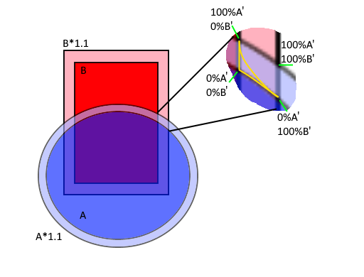

# OpenSCAD-Fillets
Super simple, 'quick and dirty' fillets with OpenSCAD for when you've made something cool but now you need fillets and don't want to redo all the hard work you put into the script.

I say 'quick and dirty' because while the technique is easy to apply, the resulting object is complex and slow to render so be careful with it.
It's not a substitute for correctly calculating the boundary and generating a proper tool path or using a proper fillet tool in a CAD package but I actually make all of my parts in OpenSCAD and wanted the ability to create fillets right there and then.

The technique relies on the thinking the fillet as a block of material that might exist between two slightly expanded versions of the objects (I call these shells).

The shells are simply the difference() between the expanded version of the object and itself (I call these A' and B' in the image below), the volume of material the fillet can exist in is the intersection() of those two shells.

All we do is intersect some percentage-expansion of objectA's shell with some percentage-expansion of objectB's shell and we get a volume of material that closely follows the contours of the two objects.

If we linearly increase the percentage-expansion of objectA's shell while linearly decreasing objectB's, we get a nice straight fillet.
If we vary the percentage-expansions using the equation of a circle, we can get some really nice, transitions between one object and the next.

From the images below, you can see the low resolution steps I've selected in the script. This value means the object is easy to render but it probably only good for FDM based additive manufacturing where the layers will probably be visible anyway.
If you're looking for supper smooth prints you can, of course, decrease the size of the step parameter, but this will seriously impact the performance of OpenSCAD.

